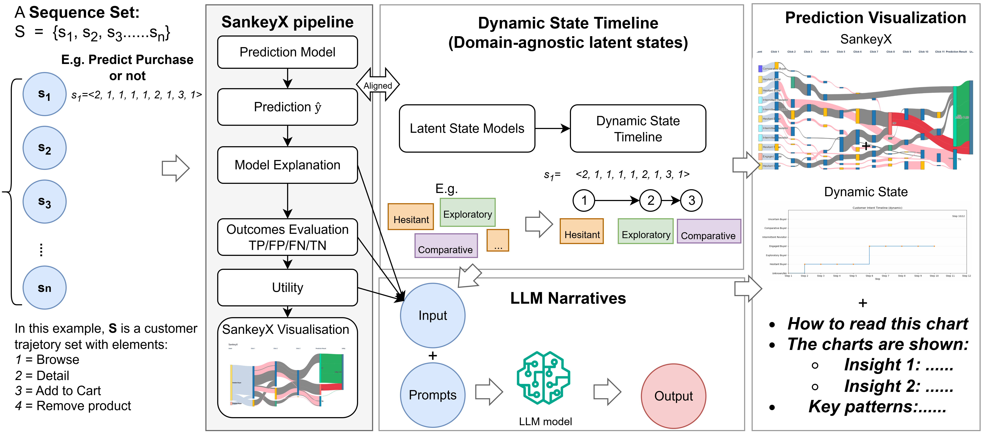

# SankeyX with Dynamic States

Interactive Streamlit app to visualize clickstream sequences as a **Sankey diagram** with **dynamic customer intent timelines**, **SHAP‑weighted flows**, outcome → **utility**, and optional **AI explanations** via a local Ollama LLM.




---

## ✨ Features
- **CSV → Interactive Sankey**: maps each session's steps into a left‑to‑right flow with stage headers (Intent → Click 1..k → Prediction → Utility).
- **Dynamic Intent Engine**: rule‑based, prefix‑evaluated intents with optional hysteresis (K) and NA bridging to stabilize state switches.
- **Per‑Session Mode**: click a specific flow to render a **GIF timeline** of intents (matplotlib animation).
- **SHAP‑Weighted Links**: positive/negative step contributions change link width (and color in the UI).
- **LLM Insights (optional)**: send a compact summary to **Ollama** to get JSON insights, strengths/weaknesses, patterns, and tips.
- **Rich Sidebar Controls**: session count, max steps, ordering (first/last), event colors, intent strategy (late vs. hysteresis), etc.

> This README is generated based on the code you provided. Paths, columns, and behaviors reflect the current implementation.

---

## 📦 Input Data Schema (CSV)
Minimal columns:
- `truncated_sequence` — list‑like string of ints (e.g., `"[1,1,2,3,5]"`).
- `SHAP_1 ... SHAP_N` — per‑step SHAP values (N should cover the longest shown sequence).
- `y_pred` — model predicted label (0/1).
- `purchase` — ground truth label (0/1).
- `Intent_type` *(optional)* — static/classic intent label used for filtering.

> The app will **parse** `truncated_sequence`, **align** SHAP to visible steps, and **truncate at the first purchase (5)** if present.

---

## 🚀 Quickstart

### 1) Install
```bash
pip install streamlit plotly pandas numpy matplotlib requests
# (optional) for click capture:
pip install streamlit-plotly-events
```

### 2) Run
```bash
streamlit run SankeyX_with_intent_dynamics.py
```

### 3) Upload Data
- Use the **sidebar** to upload your CSV.
- Tune: **N Sessions**, **Max Steps**, **Order (first/last)**, **event colors**, and **Intent Dynamics**.

### 4) Optional: Enable Ollama (local LLM)
- Install Ollama and pull a model:
  ```bash
  ollama run mistral      # or llama3.2, qwen2.5, etc.
  ```
- In the sidebar, set **Model** and toggle **Auto‑generate explanation** or click the button.

---

## ⚙️ Intent Dynamics (Rule Summary)
- Evaluate **prefixes** of the sequence at each step.
- Choose the currently “true” intent by stage ordering (**late**) or require **K consecutive confirmations** (**hysteresis**).
- **Bridge NA**: when no rule fires, optionally carry forward the last valid intent to avoid gaps.
- The **left column** can show either the **last dynamic intent** (default) or the **static intent** from the CSV.

---

## 🖼️ Outputs
- **SankeyX** (Plotly): per‑session flows, stage headers, outcomes (**TP/TN/FP/FN**), and final **Utility**.
- **On Click** (per‑session mode): a **GIF** of the dynamic intent timeline is generated and shown.
- **AI Explanation**: a tabbed JSON‑to‑paragraph view with performance, patterns, SHAP interpretation, and actionable insights.

> GIFs are saved to your user directory with a unique filename.

---

## 🔧 Troubleshooting
- **“Please upload a clickstream CSV file to begin.”** → No file was provided.
- **Missing column** → Ensure `truncated_sequence` and SHAP columns exist; `Intent_type` is optional.
- **Ollama error** → Start a local server: `ollama run mistral`. Check `http://localhost:11434` is reachable.
- **No GIF on click** → Use *Separate Sessions* mode and click a **flow/link** (not only nodes).

---

## 🧪 Tips
- Keep `Max Steps` small (e.g., 5–11) for a compact, readable Sankey.
- The app **truncates at the first purchase** (5) by design to focus on pre‑purchase logic.
- Adjust **SHAP ×** multiplier in the sidebar to accentuate link widths.

---

## 🪪 License
MIT.

## 🙌 Contributing
PRs welcome! Please open an issue for bugs/ideas and include a small CSV snippet to reproduce.

---

**Files included in this package**
- `SankeyX_with_intent_dynamics.py` — Streamlit app
- `README.md` — this file
- `sankeyx_architecture.png` — high‑level architecture diagram
